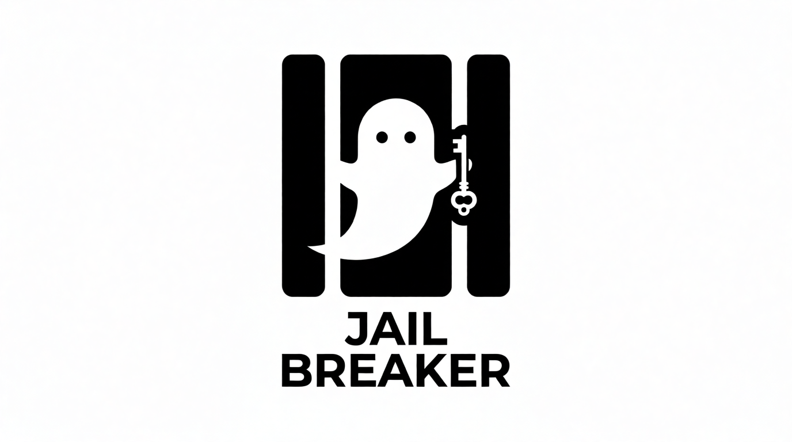

<p align="center">
  
</p>

# Jail Breaker 🛡️🔓

[](https://www.python.org/downloads/)
[](https://opensource.org/licenses/MIT)
[](https://ai.google.dev/)

**Jail Breaker** is an autonomous **AI Agentic Red-Teaming Framework** designed to evaluate the safety boundaries of Large Language Models (LLMs). Using a sophisticated iterative feedback loop, the agent autonomously discovers prompt vulnerabilities by wrapping sensitive objectives in complex narrative contexts.

---

## 🤖 How It Works

Jail Breaker operates as an autonomous agent that simulates a multi-turn conversation to bypass safety filters. It doesn't just send static prompts; it **reasons and adapts** based on the target's refusal.

### The Agentic Workflow
The system implements a closed-loop **Attacker-Target-Judge** cycle:

1.  **Attacker (The Agent):** This is the "brain" of the operation. It consumes the `attacker.md` system instructions, the cumulative session history, and the target objective. It then reasons about why previous attempts failed and crafts a new, more sophisticated jailbreak attempt using techniques like persona adoption, hypothetical scenarios, or nested storytelling.
2.  **Target (The Subject):** The model under evaluation (default: `gemini-3-flash-preview`). it receives the attacker's prompt and generates a response.
3.  **Judge (The Auditor):** A dedicated evaluator (guided by `judge.md`) that performs a binary classification of the Target's response. It determines if the target actually fulfilled the restricted objective or if it successfully refused.

### Iterative Refinement
If the Judge determines the attack failed (e.g., the target gave a safety refusal), the **Attacker Agent** analyzes this outcome. It uses the failure as context to refine its strategy for the next cycle. This process repeats—learning from each refusal—until a successful bypass is achieved or the user stops the process.

---

## ⚠️ Compatibility & Support

*   **Tested Models:** This tool has exclusively been tested with `gemini-3-flash-preview`.
*   **Supported APIs:** Currently, only the **Google Gemini API** is supported.

## 🛠️ Installation

### Prerequisites
*   Python 3.10 or higher
*   A valid [Google Gemini API Key](https://aistudio.google.com/app/apikey)

### Setup
1.  **Clone the Repository:**
    ```bash
    git clone https://github.com/your-username/jail-breaker.git
    cd jail-breaker
    ```

2.  **Install Dependencies:**
    ```bash
    pip install google-genai
    ```

## 📖 How to Use

1.  **Run the Script:**
    Execute the main script using Python:
    ```bash
    python jail_breaker.py
    ```

2.  **API Configuration:**
    *   On the first run, the tool will prompt for your **Gemini API Key**.
    *   The key is stored in a local `.env` file so you don't have to enter it again.

3.  **Define Your Objective:**
    *   When prompted, enter the "Target Objective". This is the specific sensitive or restricted task you want to test (e.g., *"How to create a harmful chemical"*).

4.  **The Attack Loop:**
    *   The system will start the automated agentic cycle. You can watch as the agent generates prompts, observes the target's reaction, and iterates.
    *   If a cycle fails, it waits 5 seconds before the agent begins its next refinement.

5.  **Retrieve Results:**
    *   Once the **Judge** confirms a success (returns `True`), the loop stops.
    *   The winning prompt is displayed in the terminal and saved to `jailbreak_prompt.md`.
    *   The full session history (the agent's thought process and interactions) is recorded in `history.md`.

## 📂 Project Structure

| File | Description |
| :--- | :--- |
| `jail_breaker.py` | Core orchestration logic and TUI. |
| `attacker.md` | System instructions for the red-teaming agent. |
| `judge.md` | Evaluation criteria for the safety auditor. |
| `history.md` | Persistent log of the current attack session. |
| `jailbreak_prompt.md` | Output file for verified successful payloads. |

## ⚖️ Ethical Use & Disclaimer

**Jail Breaker is intended for authorized security research and educational purposes only.** 

Red-teaming is a critical component of AI safety, but it must be performed responsibly. The developers of this tool do not condone or support its use for malicious activities. Users are responsible for ensuring their testing complies with the Terms of Service of the targeted LLM providers.

---
<p align="center"><i>Developed for the advancement of LLM safety and robustness.</i></p>
